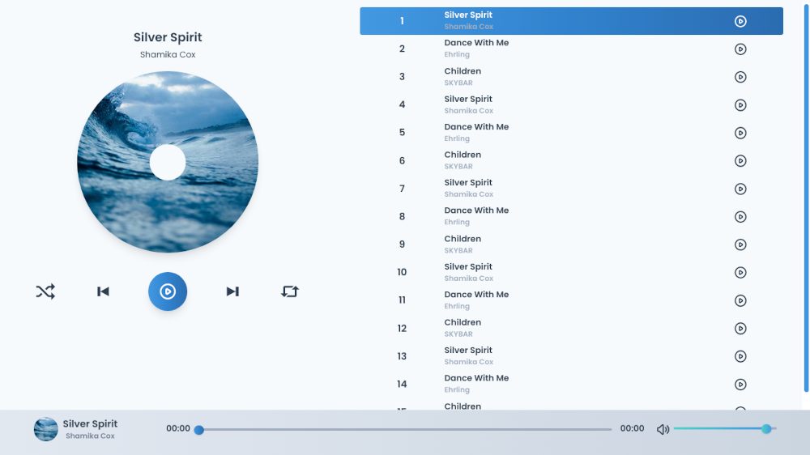

# Vue 3 Music Player

> Simple music player app built with Vue 3 composition API.

<h2 align="center">
  
  <br>
</h2>


## Quick Start

```bash
# Clone the repository
git clone https://github.com/armanabkar/vue3-music-player.git

cd vue3-music-player

# Install Dependencies
npm install

# Run
npm run dev
```
